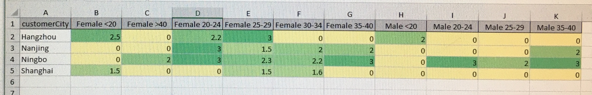

# MS Access file
[view access file](Database1.accdb)

# SQL queries

* [Online, offline, and cross-channel customers](#customer)
* [Online/ Physical bookstore managers
](#manager)
* [CRM](#CRM)
* [After-sale service managers](#Aftersales)

## Customer

number of new customers across time?

The following statement selects all transaction with customer and transaction amount.
```sql
SELECT Transaction.transactionID, Transaction.customerID,
TransactionDetail.totalAmount, Customer.customerAge,
Customer.customerGender
FROM ((Transaction
INNER JOIN TransactionDetail ON Transaction.transactionID = TransactionDetail.transactionID)
INNER JOIN Customer ON Customer.customerID = Transaction.customerID)
ORDER BY Transaction.transactionID;
```

This created a new attribution **age distribution** to categorize all customers into correspounding age groups.
```sql
SELECT Query1TransactionCustomer.customerAge,  Query1TransactionCustomer.totalAmount,
IIF(customerAge < 20, "<20",
IIF(customerAge >= 20 AND customerAge < 25, "20-24",
IIF(customerAge >= 25 AND customerAge < 30, "25-29",
IIF(customerAge >= 30 AND customerAge < 35, "30-34",
IIF(customerAge >= 35 AND customerAge < 40, "35-40",
IIF(customerAge > 40, ">40")))))) AS AgeDistribution
FROM Query1TransactionCustomer;
```

This calculates the average consumption rounded in 1 decimal of each age group.
```sql
SELECT Q1AgeDistribution.ageDistribution,
ROUND( AVG (Q1AgeDistribution.totalAmount), 1) AS averageConsumption
FROM Q1AgeDistribution
GROUP BY Q1AgeDistribution.ageDistribution
ORDER BY Q1AgeDistribution.ageDistribution;
```

This can show us the average consumoption between female and male.
```sql
SELECT Q1TransactionCustomer.customerGender,
ROUND(AVG(Q1TransactionCustomer.totalAmount), 1) AS averageConsumption
FROM Q1TransactionCustomer
GROUP BY Q1TransactionCustomer.customerGender;
```


## Manager

to find the best selling books based on users' rating **across time**

group three tables with relavent information together
```sql
SELECT Transaction.transactionID, TransactionDetail.quantity,
TransactionDetail.totalAmount AS revenue, Book.bookISBN,
Book.bookTitle, Book.bookGenre,
Transaction.transactionDate
FROM ([Transaction]
INNER JOIN TransactionDetail ON Transaction.transactionID = TransactionDetail.transactionID)
INNER JOIN Book ON Book.bookISBN = TransactionDetail.bookISBN
ORDER BY Transaction.transactionID;
```

this is the monthly and quarterly sales
```sql
SELECT DATEPART('q',  Q2BookSales.transactionDate) AS Quarter,
MONTHNAME(DATEPART('m',  Q2BookSales.transactionDate), TRUE) AS Month, 
COUNT(*) AS Sales, 
ROUND( SUM(Q2BookSales.revenue)) as monthlyRevenue
FROM Q2BookSales
GROUP BY DATEPART('q', Q2BookSales.transactionDate), DATEPART('m', Q2BookSales.transactionDate)
ORDER BY 1, 2;
```

get the best selling books across time
```sql
SELECT bookISBN, bookTitle, SUM(quantity) AS totalSales
FROM Q2BookSales
GROUP BY bookISBN,  bookTitle
ORDER BY  SUM(quantity) DESC;
```

get genre monthly sale matrix
```sql
-- get a list
SELECT MonthName(Month(transactionDate)) as month, bookGenre,  COUNT(quantity) as sales
FROM Q2BookSales
GROUP BY Month(transactionDate), bookGenre;

-- get the matrix
TRANSFORM Max(sales)
SELECT month
FROM Q2MonthGenreSale
GROUP BY month
PIVOT bookGenre;
```


## CRM

to find the customer with most purchases in a given period of time and probably catigorized them into different groups based on their gender and age, to see which type (age and gender) of customer accounts for the most revenues -> target them in the future


```sql
-- age gender
-- Join relevant tables: customer, transaction, transactiondetail, book
SELECT Transaction.transactionID, Book.bookGenre,
TransactionDetail.quantity, Customer.customerAge,
Customer.customerCity, Customer.customerVIPLevel,
Customer.customerGender,
Transaction.TransactionDate
FROM (([Transaction] 
INNER JOIN TransactionDetail ON Transaction.transactionID = TransactionDetail.transactionID) 
INNER JOIN Customer ON Customer.customerID = Transaction.customerID)
INNER JOIN Book ON Book.bookISBN = TransactionDetail.bookISBN
ORDER BY Transaction.transactionID;
```


sales across gender and age
```sql
-- age gender city
SELECT Q3CRM.customerAge, Q3CRM.quantity, Q3CRM.customerCity,
SWITCH (
customerGender = "F" AND customerAge < 20, "Female <20",
customerGender = "F" AND customerAge >= 20 AND customerAge < 25 , "Female 20-24",
customerGender = "F" AND customerAge >= 25 AND customerAge < 30, "Female 25-29",
customerGender = "F" AND customerAge >= 30 AND customerAge < 35, "Female 30-34",
customerGender = "F" AND customerAge >= 35 AND customerAge < 40, "Female 35-40",
customerGender = "F" AND customerAge > 40, "Female >40",

customerGender = "M" AND customerAge < 20, "Male <20",
customerGender = "M" AND customerAge >= 20 AND customerAge < 25 , "Male 20-24",
customerGender = "M" AND customerAge >= 25 AND customerAge < 30, "Male 25-29",
customerGender = "M" AND customerAge >= 30 AND customerAge < 35, "Male 30-34",
customerGender = "M" AND customerAge >= 35 AND customerAge < 40, "Male 35-40",
customerGender = "M" AND customerAge > 40, "Male >40"
) AS ageGender
FROM Q3CRM;

```


```sql
-- age gender city
SELECT Q3AgeGender.ageGender, Q3AgeGender.customerCity,
ROUND( AVG (Q3AgeGender.quantity), 1) AS sales
FROM Q3AgeGender
GROUP BY Q3AgeGender.ageGender, Q3AgeGender.customerCity
ORDER BY Q3AgeGender.ageGender;

-- age gender city matrix
-- nz(,0) sets a cell's value to 0 if sales equals to Null originally
TRANSFORM nz(Max(sales), 0)
SELECT customerCity
FROM Q3AgeGenderCity
GROUP BY customerCity
PIVOT ageGender;
```

The result of the above query is then exported to excel to create this colored sales analysis with respect to gender, age, and location.



## Aftersales

relationship bwtween number of exchanges/returns with different products

relationship bwtween number of exchanges/returns with different customer groups


fetch book information
```sql
SELECT Transaction.transactionID, Book.bookGenre, TransactionDetail.quantity,
Customer.customerAge, Customer.customerCity, Customer.customerVIPLevel,
Customer.customerGender, Transaction.TransactionDate
FROM (([Transaction]
INNER JOIN TransactionDetail ON Transaction.transactionID = TransactionDetail.transactionID)
INNER JOIN Customer ON Customer.customerID = Transaction.customerID)
INNER JOIN Book ON Book.bookISBN = TransactionDetail.bookISBN
ORDER BY Transaction.transactionID;
```

fetch customer information
```sql
SELECT AftersalesService.aftersalesServiceID,  AftersalesService.aftersalesServiceType,
Customer.customerFirstName, Customer.customerSurname,
Customer.customerPhoneNumber, Customer.customerEmail,
Customer.customerVIPLevel
FROM ([AftersalesService]
INNER JOIN Transaction ON AftersalesService.transactionID = Transaction.transactionID)
INNER JOIN Customer ON Transaction.customerID = Customer.customerID
ORDER BY AftersalesService.aftersalesServiceID;
```


-- offline or online with the most returns/exchanges
```sql
SELECT Q4Customer.customerID, Transaction.transactionID, 
IIF(IsNull(Transaction.expressID) = true, "offline",
IIF(IsNull(Transaction.expressID) = false, "online")) AS [ONLINE/OFFLINE],
Transaction.expressID
FROM Q4Customer, Transaction
WHERE Q4Customer.customerID = Transaction.customerID ;
```


## Kimmy

```sql
SELECT Customer.customerID, Transaction.transactionTotalPrice,
Customer.customerAge, Customer.customerGender
FROM Customer, Transaction
WHERE Customer.customerID = Transaction.customerID;
```


# legacies

### 4.5.1 create table order details
```sql
CREATE TABLE OrderDetails (
  orderID TEXT PRIMARY KEY, -- only one primary key is enough
  bookISNB TEXT NOT NULL Book(bookISBN),
  orderQuantity NUMBER NOT NULL,
);
```


### 4.8 create table aftersale service
```sql
CREATE TABLE AftersalesService (
  aftersalesServiceID TEXT PRIMARY KEY,
  orderID TEXT REFERENCES Order(orderID),
  aftersalesServiceType TEXT
);
```

### 4.9 create table feedback
```sql
CREATE TABLE Feedback (
  feedbackID TEXT PRIMARY KEY,
  orderID TEXT REFERENCES Order(orderID),
  feedbackRating NUMBER,
  feedbackDetails TEXT
);
```

### 5.1 find customers with the most frequent purchases

```sql
SELECT customerName, customerAge, customerPhoneNumber,
  (SELECT COUNT(*)
    FROM Order
    WHERE Order.customerID = Customer.CustomerID) AS orders
  FROM Customer,
  GROUP BY customerName
  ORDER BY orders DESC;
```


### 5.2 find the top 5 selling book
```sql
SELECT bookISBN, bookTitle
  (SELECT COUNT(*)
    FROM Order
    WHERE Order.bookISBN = Book.bookISBN) AS sales
  FROM Book,
  GROUP BY customerName
  ORDER BY sales DESC
  LIMIT 5;
```

### 5.3 book feedback
```sql
SELECT AVG(feedbackRating)
  (SELECT bookISBN
    FROM Order
    WHERE Order.orderID = Feedback.orderID)
  FROM Feedback
```


### 5.4 sales in age distributions
```sql
-- NOT FINISHED
SELECT
  customerAge,
  IIF(customerAge < 20, "<20",
  IIF(customerAge >= 20 AND customerAge < 25, "20-24",
  IIF(customerAge >= 25 AND customerAge < 30, "25-29",
  IIF(customerAge >= 35 AND customerAge < 35, "30-34",
  IIF(customerAge >= 35 AND customerAge < 40, "35-40",
  IIF(customerAge > 40, ">40")))))) AS AgeDistribution,
  (SELECT COUNT(*)
    FROM Order
    WHERE )
  FROM Customer
  ORDER BY sales DESC;
```